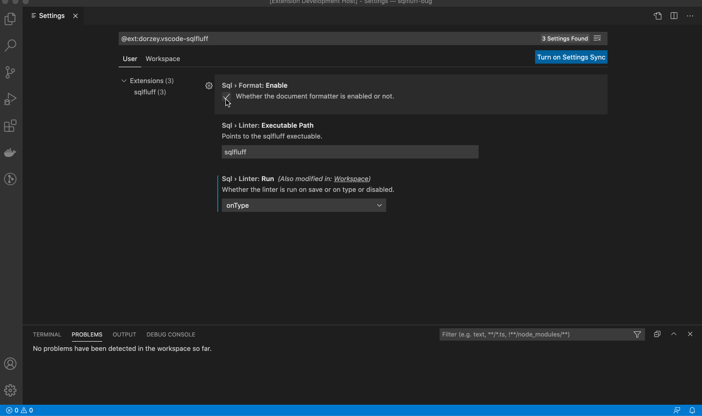

## Sponsor

<picture>
  <source media="(prefers-color-scheme: dark)" srcset="images/datacoves-dark.png">
  
</picture>

Hosted VS Code, dbt-core, SqlFluff, and Airflow, find out more at [Datacoves.com](https://datacoves.com/product).

# vscode-sqlfluff


A linter and auto-formatter for [SQLFluff](https://github.com/alanmcruickshank/sqlfluff), a popular linting tool for SQL and dbt.


You can run [Format Document](https://code.visualstudio.com/docs/editor/codebasics#_formatting) to fix the linting violations. You cannot run Format Selection. Please note that not all linting violations are automatically fixable.

## Configuration

The extension expects sqlfluff to be installed and already added to the path. If it is installed but cannot be found, add the path to your preferences as seen below. Find the path by typing `which sqlfluff` into your terminal.

Edit your VS Code `settings.json` file manually or through the user interface.

If you want to manually update the `settings.json` file, open the VS Code command palette and type in `settings.json`. Select `Preferences: Open Settings`. Then, you can add any of the following configuration options to `settings.json`.

```json
  "sqlfluff.config": "${workspaceFolder}/.sqlfluff",
  "sqlfluff.dialect": "mysql",
  "sqlfluff.env.environmentVariables": [
    {
      "key": "example_key",
      "value": "example_value"
    }
  ],
  "sqlfluff.env.customDotEnvFiles": [
    "${workspaceFolder}/example.env"
  ],
  "sqlfluff.env.useDotEnvFile": true,
  "sqlfluff.excludeRules": ["L009"],
  "sqlfluff.executablePath": "sqlfluff",
  "sqlfluff.ignoreLocalConfig": false,
  "sqlfluff.ignoreParsing": false,
  "sqlfluff.rules": [],
  "sqlfluff.suppressNotifications": false,
  "sqlfluff.workingDirectory": "",
  /* Linter */
  "sqlfluff.linter.arguments": [],
  "sqlfluff.linter.run": "onType",
  "sqlfluff.linter.diagnosticSeverity": "error",
  "sqlfluff.linter.diagnosticSeverityByRule": [
    {
      "rule": "L010",
      "severity": "warning"
    }
  ],
  "sqlfluff.linter.lintEntireProject": true,
  /* Formatter */
  "sqlfluff.format.arguments": ["--FIX-EVEN-UNPARSABLE"],
  "sqlfluff.format.enabled": true,
```

## DBT Configuration

DBT setup requires these settings to lint and format the document.

```json
  "sqlfluff.linter.run": "onSave",
  "sqlfluff.experimental.format.executeInTerminal": true,
  "editor.formatOnSave": false,
```

### Format file

By default you will be able use SQLFluff fix your file by formatting. Same as calling `sqlfluff fix <path>`



### Show Documentation

Hovering over a problem with reveal a popup explaining the problem and giving a link to the documentation.

For SQLFluff versions after v2.0.0 this link will take you to the rule documentation.

For SQLFLuff versions before v2.0.0 this link will take you to the top of the documentation page.

### VSCode Variables

The `executablePath` and `config` settings can use some VSCode variables.
This is achieved by using the format `${variableName}` in the settings.
Here are a few useful ones.

- fileWorkspaceFolder: the path of the workspace folder containing the file opened in VS Code
- workspaceFolder: the path of the first workspace folder opened in VS Code
- workspaceFolderBasename: the last portion of the path of the folder opened in VS Code
- fileDirname: the current opened file's dirname

And here are a few that are probably useless.

- file: the current opened file
- relativeFile: the current opened file relative to workspaceFolder
- fileBasename: the last portion of the path to the file
- fileBasenameNoExtension: the last portion of the path to the file with no extension
- fileExtname: the current opened file's extension
- lineNumber: the current selected line number in the active file
- selectedText: the current selected text in the active file
- execPath: the path to the running VS Code executable

## Running into Problems?

Open the command palette and run the `SQLFluff Debug Extension` command

Check the output channel to see the SQLFluff commands this extension is running


If that doesn't help narrow down your problem, you can open an issue at https://github.com/sqlfluff/vscode-sqlfluff/issues


## Open-VSX

[open-vsx.org/extension/sqlfluff/vscode-sqlfluff](https://open-vsx.org/extension/sqlfluff/vscode-sqlfluff)

## Credits / Links

- [dorzey](https://github.com/sqlfluff/vscode-sqlfluff)
- [VSCode's Extensions Samples](https://github.com/microsoft/vscode-extension-samples/tree/main/test-provider-sample)
- [VSCode's Testing Documentation](https://code.visualstudio.com/api/extension-guides/testing)

## License

The MIT License (MIT). Please see the [license file](LICENSE.md) for more information.
